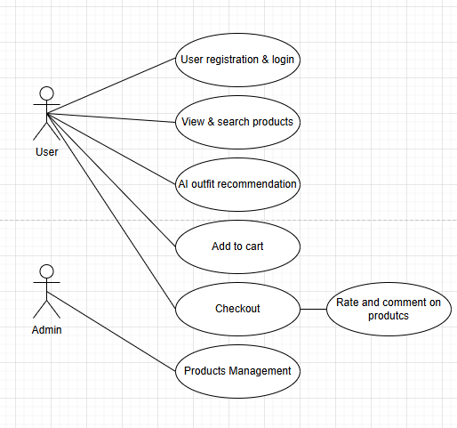
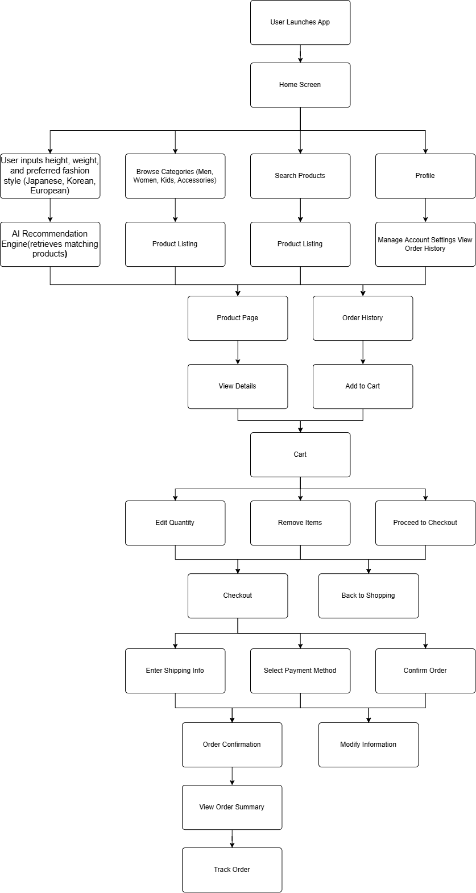
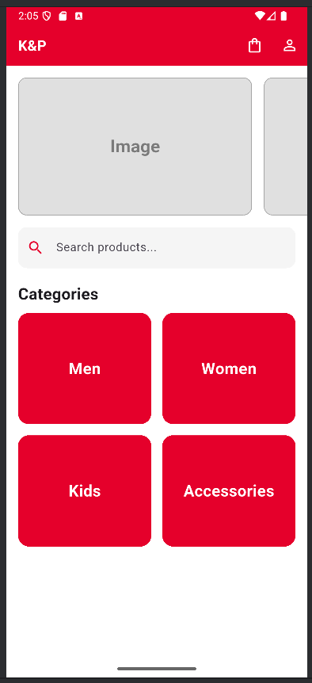
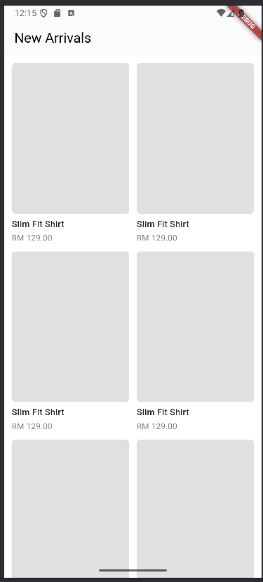
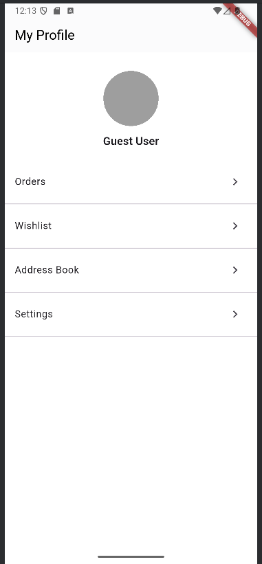
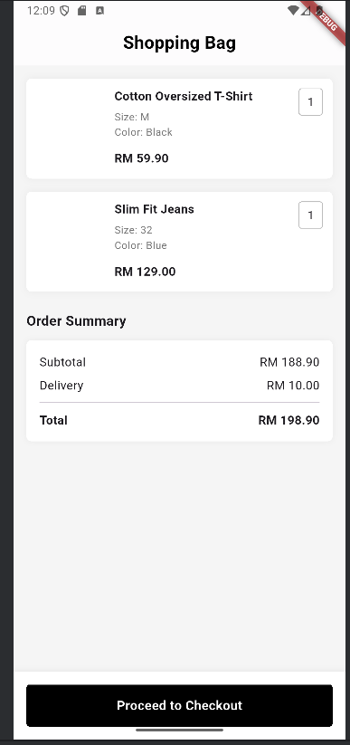
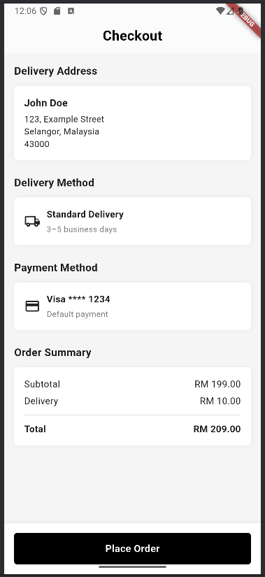
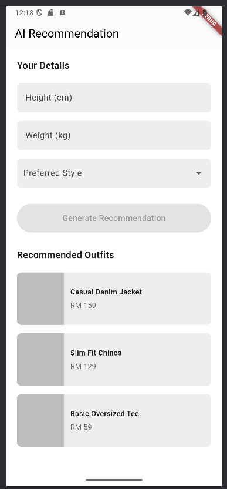
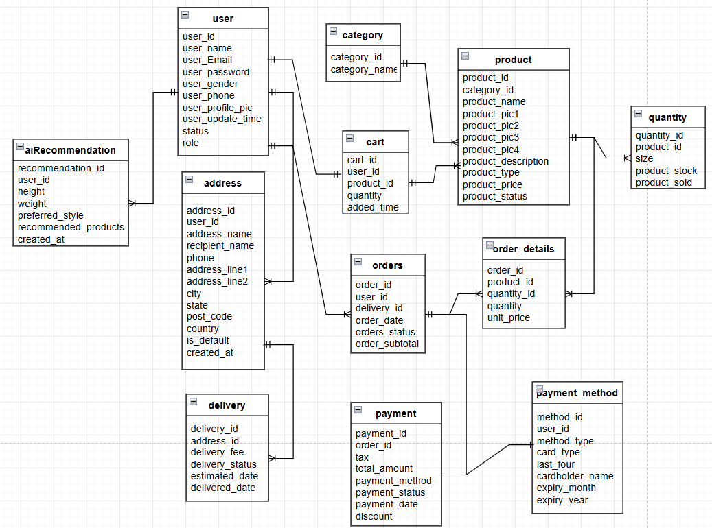
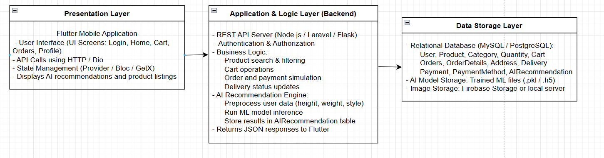

> **AI-Powered** **Clothing** **App** **for** **Personalized**
> **Outfit** **Recommendation** style="width:4.05208in;height:1.17708in" />
>
> **By**
>
> **Sia** **Jin** **Sheng**
>
> FACULTY OF COMPUTING AND INFORMATION TECHNOLOGY

TUNKU ABDUL RAHMAN UNIVERSITY OF MANAGEMENT AND TECHNOLOGY KUALA LUMPUR

> ACADEMIC YEAR **2025/26**
>
> AI-Powered Clothing App for Personalized Outfit Recommendation By
>
> Sia Jin Sheng
>
> Supervisor: Ms SITI NADIAH BINTI NAIN
>
> A project report submitted to the
>
> Faculty of Computing and Information Technology in partial fulfillment
> of the requirement for the
>
> **Bachelor** **of** **Information** **Technology** **(Honours)**
> **in** **Software** **Systems** **Development**
>
> Faculty of Computing and Information Technology
>
> Tunku Abdul Rahman University of Management and Technology Kuala
> Lumpur

**Copyright** **by** **Tunku** **Abdul** **Rahman** **University**
**of** **Management** **and** **Technology.**

**All** **rights** **reserved.** **No** **part** **of** **this**
**project** **documentation** **may** **be** **reproduced,** **stored**
**in** **retrieval** **system,** **or** **transmitted** **in** **any**
**form** **or** **by** **any** **means** **without** **prior**
**permission** **of** **Tunku** **Abdul** **Rahman** **University**
**of** **Management** **and** **Technology.**

**Declaration**

The project submitted herewith is a result of my own efforts in totality
and in every aspect of the project works. All information that has been
obtained from other sources had been fully acknowledged. I understand
that any plagiarism, cheating or collusion or any sorts constitutes a
breach of TAR University rules and regulations and would be subjected to
disciplinary actions.

> **\_\_\_\_\_\_\_\_\_\_\_\_\_\_\_\_\_\_\_\_\_\_\_\_\_\_**
>
> Sia Jin Sheng
>
> Bachelor of Information Technology (Honours) in Software Systems
> Development ID: 24WMR16773

**Abstract**

This project presents the development of an AI-powered clothing mobile
application designed to provide personalized outfit recommendations
based on a user’s height, weight, gender, and preferred fashion style.
The project addresses the common challenge faced by online shoppers who
struggle to select clothing that fits their personal style and body
measurements, often resulting in dissatisfaction and product returns. By
integrating machine learning-based recommendation logic with a mobile
user interface, the system aims to enhance user confidence during the
shopping process and improve product discovery.

The scope of the project includes the construction of a Flutter-based
mobile application, a backend service for AI processing, and a
structured database storing product, user, and recommendation data. Core
features include user authentication, product browsing, cart management,
wishlist, order simulation, and AI-generated outfit recommendations
tailored to individual user profiles.

The system employs a rule-based filtering model combined with similarity
scoring to compute personalized recommendations. Firebase
Authentication, real-time database storage, and REST API communication
were used throughout development. Testing involved functional validation
of user flows, UI/UX testing, and evaluation of the AI recommendation
accuracy using predefined scenarios.

The results show that the developed application successfully provides
relevant outfit suggestions and delivers smooth user interaction. While
the AI model is lightweight and suitable for prototype use, future
improvements may include implementing a deeper learning model and
expanding the dataset for better personalization. Overall, the project
demonstrates the feasibility of integrating AI-driven recommendations
into a mobile shopping application and provides a solid foundation for
future enhancements.

**Acknowledgement**

I would like to express my sincere gratitude to my supervisor, Ms. Siti
Nadiah Binti Nain, for her guidance, support, and constructive feedback
throughout the duration of this project. Her encouragement and expertise
have been invaluable in shaping the direction and quality of this work.
I would also like to thank the lecturers and moderators who provided
academic insights and support along the way. My heartfelt appreciation
goes to my family and friends for their continuous motivation,
understanding, and patience during the development of this project.
Their support has been instrumental to the successful completion of this
work.

**Chapter** **1:** **Introduction** **8** 1.1 Project Objectives 8 1.2
Project Background 8 1.3 Advantages and Contributions 9 1.3.1 Advantages
for Consumers 9

> 1.3.2 Contributions to the Industry 9 1.3.3 Contributions to Research
> 9 1.4 Project Plan 10 1.5 Project Team and Organization 10 1.6 Chapter
> Summary and Evaluation 11

**Chapter** **2:** **Literature** **Review** **12** 2.1 Introduction 12
2.2 Related Studies on Fashion Recommendation Systems 12 2.3 Artificial
Intelligence and Machine Learning in Fashion 12 2.4 E-Commerce
Application Features and Design 13

> 2.5 Related Systems Comparison 13 2.6 Summary and Evaluation 14 2.7
> Reference 14

**Chapter** **3:** **Methodology** **And** **Requirements** **Analysis**
**15** 3.1 Introduction 15 3.2 Methodology 15

> 3.2.1 Selected Development Model: Agile Development 15 3.2.2
> Advantages of Agile for This Project 15
>
> 3.3 Requirements Gathering Techniques 16 3.4 Requirements Analysis 16
> 3.4.1 Use Case Diagram 16
>
> 3.4.2 Data Flow Diagram (DFD) – Level 0 17 3.5 Functional and
> Non-Functional Requirements 17
>
> 3.5.1 Functional Requirements 17 3.5.2 Non-Functional Requirements 18

3.6 Chapter Summary and Evaluation 18 **CHAPTER** **4** **–** **SYSTEM**
**DESIGN** **19** 4.1 System Overview / Workflow Design 19 4.1.1 System
Workflow Steps 19

> 4.1.2 Workflow Diagram (Description) 22 4.2 User Interface (UI) /
> System Interaction Design 22 4.2.1 UI Wireframe Description 22 Home
> Screen 24 Login & Registration Screen 24 Product List Screen 24
> Product Details Screen 24
>
> AI Recommendation Screen 24 Cart & Checkout Screen 24 User Profile
> Screen 25 4.3 Data Design 25 4.3.1 Entity Relationship Diagram (ERD)
> 25 4.3.2 Class Diagram 26 4.3.3 Database Schema 27 Table: User 27
>
> **Table:** **Category** **28** **Table:** **Product** **28**
> **Table:** **Quantity** **(Product** **Variant)** **28** **Table:**
> **Cart** **28** **Table:** **Orders** **29** **Table:**
> **Order_Details** **29** **Table:** **Address** **29** **Table:**
> **Delivery** **30** **Table:** **Payment** **30** **Table:**
> **Payment_Method** **31** **Table:** **AIRecommendation** **31**
>
> 4.4 Software Architecture Design 32 4.4.1 Layers 32 4.4.2 Architecture
> Diagram 33 4.5 Process Design 33 4.5.1 Login Validation Process 33
> 4.5.2 AI Recommendation Process 33 4.5.3 Simulated Payment Process 34

**4.6** **Algorithm** **/** **Model** **Design** **34** 4.6.1 Algorithm
Overview and Justification 34 4.6.2 Model Input Features 35 User
Features 35 Product Features 35 4.6.3 Model Architecture 35 Model Layers
35 4.6.4 Activation & Loss Functions 35 4.6.5 Compatibility Scoring
Formula 36 4.6.6 Final Prediction Equation 36

> 4.7 Security Design 36 Security Measures Implemented 36 4.8 Chapter
> Summary and Evaluation 37

**Chapter** **1:** **Introduction** **1.1** **Project** **Objectives**

The primary goal of this project is to design and develop a mobile
fashion e-commerce application that addresses the limitations of
existing platforms by integrating artificial intelligence (AI) for
personalized outfit recommendations. Traditional e-commerce applications
such as those offered by H&M, Uniqlo, Zara, and Padini provide product
browsing, cart management, and user accounts but lack a strong emphasis
on personalization tailored to individual users.

To bridge this gap, the objectives of the project are as follows:

> 1\. **Develop** **a** **comprehensive** **mobile** **application**
> **for** **online** **clothing** **retail** that includes standard
>
> e-commerce functionalities such as product browsing by category, cart
> and wishlist management, and secure authentication. This ensures that
> the system can meet basic user expectations while serving as a
> functional shopping platform.
>
> 2\. **Implement** **an** **AI-powered** **recommendation** **engine**
> that uses users’ body profile information (e.g., height and weight)
> and preferred fashion styles (e.g., Japanese, Korean, European) to
> suggest appropriate outfits. Unlike generic recommendation engines
> that rely on purchase history or collaborative filtering, this engine
> aims to generate personalized and practical recommendations aligned
> with user needs.
>
> 3\. **Enhance** **customer** **engagement** **through**
> **value-added** **features** such as wishlist creation, product
> reviews, ratings, and user profile customization. These features allow
> customers to interact more actively with the platform, improving trust
> and satisfaction.
>
> 4\. **Improve** **user** **experience** **by** **reducing** **time**
> **spent** **searching** **for** **appropriate** **items** and
> minimizing frustration from purchasing clothes that do not fit or suit
> their style. By doing so, the project also addresses the problem of
> high cart abandonment rates common in online fashion e-commerce.
>
> 5\. **Contribute** **to** **inclusivity** **and** **cultural**
> **diversity** **in** **online** **shopping**, as the system will cater
> to different body types and provide style recommendations influenced
> by multiple cultural fashion trends.

These objectives form the foundation of the project, ensuring that the
final system not only replicates standard e-commerce features but also
innovates by leveraging AI-driven personalization.

**1.2** **Project** **Background**

The fashion and apparel industry represents one of the largest and
fastest-growing segments of global

e-commerce. In Southeast Asia, the market is expected to generate USD
53.45 billion in revenue by 2025, supported by an annual growth rate of
3.6% (Statista, 2023). This trend is largely driven by the region’s
mobile-first consumer behavior, with 89% of internet users accessing the
web primarily via smartphones (MarketResearchSEA, 2023). Moreover, 94%
of urban internet users in the region engage in e-commerce, indicating
strong adoption of digital shopping (Daxue Consulting, 2022).

Despite this promising growth, online fashion shopping remains fraught
with challenges. One of the most significant problems is the lack of
personalization. Shoppers often find it difficult to identify items that
fit both their

physical measurements and personal style preferences. Unlike in physical
stores, customers cannot try on clothes before purchase, which often
leads to mismatched sizing, dissatisfaction, and high product return
rates. This inefficiency contributes to cart abandonment, with research
showing that 82% of users abandon their shopping carts due to poor user
experience (VWO, 2023).

Existing mobile applications developed by global fashion retailers
primarily focus on replicating the in-store browsing experience,
offering users a catalog of products, filtering options, and basic
recommendations such as “customers who bought this also bought…” While
these features provide some convenience, they fail to address the deeper
needs of consumers who desire personalized suggestions that consider
body type, style preferences, and cultural influences.

This project therefore seeks to fill this gap by creating an application
that not only incorporates the standard

e-commerce functions but also integrates an AI recommendation system. By
analyzing both quantitative (body profile) and qualitative (stylistic
preference) inputs, the system aims to provide users with more accurate
and meaningful outfit suggestions.

**1.3** **Advantages** **and** **Contributions**

**1.3.1** **Advantages** **for** **Consumers**

The most immediate advantage of the proposed system is an improved user
experience. Consumers will benefit from:

> ● **Personalized** **recommendations** that are based on both physical
> measurements and fashion preferences, ensuring that suggested outfits
> are more relevant and practical.
>
> ● **Time-saving** **features**, as users can quickly discover suitable
> products without having to browse through an extensive catalog.
>
> ● **Increased** **confidence** **in** **purchasing**, reducing the
> likelihood of returns and dissatisfaction.
>
> ● **Engagement** **features** such as ratings, comments, and wishlists
> that foster a sense of interaction similar to social commerce
> platforms.

**1.3.2** **Contributions** **to** **the** **Industry**

From a business perspective, the application demonstrates how artificial
intelligence can be practically applied to improve personalization in
the fashion retail industry. This project contributes to the industry
by:

> ● **Reducing** **cart** **abandonment** **rates** by offering
> better-targeted product suggestions.
>
> ● **Encouraging** **inclusivity** in fashion retail by catering to a
> wider variety of body types and cultural styles.
>
> ● **Supporting** **trend** **adaptation**, as the AI model can be
> updated with new datasets to reflect seasonal and cultural fashion
> changes.

**1.3.3** **Contributions** **to** **Research**

The academic contribution of this project lies in exploring how AI can
be applied in fashion e-commerce through a dual-input recommendation
approach. While most recommendation systems rely solely on collaborative
filtering or purchase history, this project integrates physical body
data with style-specific datasets. This approach opens

new avenues for research into more holistic recommendation engines that
blend technical efficiency with cultural and stylistic adaptability.

**1.4** **Project** **Plan**

The project will be developed in stages to ensure structured progress
and proper evaluation:

> ● **Phase** **1:** **Core** **Services** **(July** **–** **September**
> **2025)**
>
> ○ Conduct background study and finalize system requirements.
>
> ○ Implement essential app features such as product browsing, account
> management, shopping cart, and simulated checkout.
>
> ○ Develop and integrate the AI-powered recommendation engine for
> personalized outfit suggestions.
>
> ● **Phase** **2:** **Extended** **Services** **(October** **–**
> **December** **2025)**
>
> ○ Add wishlist functionality, ratings, and comments.
>
> ○ Build user profile management features (edit details, view history).
>
> ○ Optionally design and implement an admin panel for product
> management.
>
> ● **Phase** **3:** **Testing** **and** **System** **Preview**
> **(January** **–** **March** **2026)**
>
> ○ Create detailed test plans and test cases.
>
> ○ Conduct functional, usability, and performance testing.
>
> ○ Present a prototype for review and refine based on feedback.
>
> ● **Phase** **4:** **Finalization** **and** **Documentation**
> **(March** **–** **April** **2026)**
>
> ○ Complete integration of all features.
>
> ○ Finalize report submission and system documentation.

This phased approach ensures that the project is completed on time while
allowing room for testing, feedback, and improvements.

**1.5** **Project** **Team** **and** **Organization**

This project is undertaken by:

> ● **Student** **Researcher:** Sia Jin Sheng (RSD2S3 G6)
>
> ● **Supervisor:** Ms. Siti Nadiah Binti Nain

As this is an individual project, the student researcher is responsible
for all aspects, including system design, development, testing, and
documentation. The supervisor’s role is to provide academic guidance,
monitor progress, and evaluate deliverables at each milestone.

The project organization follows a simple structure:

> ● **Student:** Responsible for technical implementation, research, and
> reporting.
>
> ● **Supervisor:** Provides oversight, ensures project relevance, and
> assesses quality.

This lean structure ensures efficient communication and accountability
throughout the project lifecycle.

**1.6** **Chapter** **Summary** **and** **Evaluation**

This chapter introduced the project by highlighting its objectives,
background, advantages, contributions, plan, and organization. The
project addresses a pressing gap in the online fashion retail industry,
where personalization remains limited despite technological advances. By
integrating AI with e-commerce, the project seeks to create a platform
that not only meets basic consumer needs but also enhances inclusivity
and personalization.

The evaluation of this chapter indicates that the proposed system:

> ● Aligns with industry growth trends in Southeast Asia.
>
> ● Offers clear consumer, industrial, and academic contributions.
>
> ● Has a feasible implementation plan with defined phases and
> milestones.

The foundation established in this chapter provides the basis for the
following sections. **Chapter** **2** **will** **present** **a**
**detailed** **literature** **review,** **examining** **existing**
**works** **on** **AI** **in** **e-commerce,** **recommendation**
**systems,** **and** **fashion** **retail** **applications.**

> Chapter 2: Literature Review 2.1 Introduction
>
> This chapter reviews existing studies, technologies, and related
> systems relevant to the development of an AI-powered clothing
> e-commerce application. It focuses on fashion recommender systems,
> machine learning
>
> techniques, AI-based personalization, and e-commerce design practices.
> The aim is to establish the theoretical and practical foundation for
> the proposed system.
>
> 2.2 Related Studies on Fashion Recommendation Systems
>
> Fashion recommender systems (FRS) use machine learning algorithms to
> suggest clothing items based on user preferences, purchase history, or
> visual similarity. According to Liu et al. (2023), hybrid recommender
> systems that combine user-based and content-based filtering show
> improved accuracy in fashion-related recommendations.
>
> Existing research also explores the integration of **body**
> **measurement** **data** into fashion recommendations. For instance,
> Park and Yoo (2022) demonstrated that user height and weight can
> significantly enhance the relevance of outfit suggestions compared to
> purely visual-based models. However, few applications combine
> **physical** **measurements** **with** **stylistic** **preferences**
> such as cultural fashion styles (e.g., Japanese or Korean aesthetics).
>
> 2.3 Artificial Intelligence and Machine Learning in Fashion
>
> AI and machine learning play a major role in enabling personalization
> in fashion retail. Deep learning techniques such as Convolutional
> Neural Networks (CNNs) are often applied to clothing image
> recognition, while Natural Language Processing (NLP) models are used
> for product description matching.
>
> The proposed system will utilize a **pre-trained** **recommendation**
> **model** that can interpret numeric (height, weight) and categorical
> (style preference) data to recommend suitable outfits. Using a
> pre-trained model reduces training time and ensures feasibility within
> the FYP duration.

||
||
||
||
||
||
||

> **2.4** **E-Commerce** **Application** **Features** **and** **Design**
>
> E-commerce applications such as H&M, Uniqlo, and Zara offer essential
> features including product browsing, wishlists, carts, and user
> authentication. However, their recommendation systems are often
> limited to category-based filters or trending products.
>
> Research by Chiu and Wong (2021) found that **AI-driven**
> **personalization** **increases** **customer** **engagement** **by**
> **35%** in e-commerce environments. Thus, incorporating AI
> recommendations, ratings, and feedback mechanisms is key to enhancing
> user experience and loyalty.
>
> Core e-commerce design considerations include:
>
> ● **Usability:** Simple, clean interfaces that support efficient
> browsing.
>
> ● **Security:** Safe authentication and data protection measures.
>
> ● **Responsiveness:** Mobile-first design ensuring cross-platform
> compatibility.
>
> **2.5** **Related** **Systems** **Comparison**

||
||
||
||
||
||
||

> The proposed system differs from competitors by integrating user body
> profile and style preferences into AI-driven outfit recommendations.

**2.6** **Summary** **and** **Evaluation**

This chapter reviewed the current literature and systems relevant to
fashion recommendation applications. Studies indicate that AI and
machine learning significantly improve personalization in fashion
e-commerce. However, current market applications lack integration
between body measurement data and cultural fashion preferences.

The proposed system fills this research and commercial gap by combining
both dimensions, offering a hybrid recommendation model that improves
inclusivity and personalization. This literature foundation supports the
project’s innovation and technical feasibility.

**2.7** **Reference**

> ● Chiu, T., & Wong, L. (2021). *AI* *Personalization* *in*
> *E-Commerce:* *User* *Engagement* *and* *Purchase* *Intentions.*
> Journal of Retail Technology, 14(3), 45–56.
>
> ● Liu, J., Zhang, M., & Li, S. (2023). *A* *Hybrid* *Fashion*
> *Recommendation* *System* *Using* *Visual* *and* *Attribute*
>
> *Data.* IEEE Transactions on Consumer Electronics.
>
> ● Park, Y., & Yoo, J. (2022). *Body-Aware* *Fashion*
> *Recommendations:* *Integrating* *Anthropometric* *Data* *in* *AI*
>
> *Models.* Computers in Industry, 139, 103–121.

Chapter 3: Methodology And Requirements Analysis **3.1**
**Introduction**

This chapter outlines the methodology used in developing the proposed
mobile clothing e-commerce application with AI-based outfit
recommendations. It also discusses the requirements gathering process,
requirement analysis (including diagrams), and the identification of
functional and non-functional requirements. The aim is to ensure that
the development process is systematic, practical, and aligned with the
project objectives.

**3.2** **Methodology**

**3.2.1** **Selected** **Development** **Model:** **Agile**
**Development**

The **Agile** **development** **model** was chosen due to its
flexibility and suitability for projects that involve iterative
improvements and evolving requirements. Since this project involves both
AI integration and UI/UX optimization, Agile enables incremental
progress through sprints, allowing feedback and adaptation at each
stage.

**Key** **Agile** **Phases:**

> 1\. **Planning:** Define objectives, scope, and features.
>
> 2\. **Design:** Create system architecture and UI/UX mockups.
>
> 3\. **Development:** Implement core modules such as authentication,
> product management, and AI
>
> recommendation.
>
> 4\. **Testing:** Conduct functional and usability testing in each
> sprint.
>
> 5\. **Review:** Collect supervisor and user feedback for improvement.
>
> 6\. **Deployment:** Prepare the final, tested prototype for
> demonstration.

**3.2.2** **Advantages** **of** **Agile** **for** **This** **Project**

> ● Allows continuous integration of AI and UI features.
>
> ● Supports dynamic adjustments based on supervisor feedback.
>
> ● Reduces project risks by ensuring deliverables at each sprint.
>
> ● Encourages collaboration and iterative testing.
>
> 3.3 Requirements Gathering Techniques
>
> The requirements for the proposed system were collected through a
> combination of **primary** and **secondary** data collection methods.

||
||
||
||
||
||
||

> 3.4 Requirements Analysis
>
> The requirements analysis focuses on defining system components, data
> flow, and interactions between users and the system.
>
> **3.4.1** **Use** **Case** **Diagram** **Main** **Actors:**
>
> ● **User:** Browse products, receive recommendations, rate/comment,
> manage profile. ● **Admin:** Manage product listings and monitor user
> activities.
>
> **Use** **Cases:**
>
> ● User registration/login
>
> ● View and search products ● AI outfit recommendation ● Add to
> cart/wishlist
>
> ● Rate and comment on products ● Checkout
>
> ● Manage user profile
>
> ● Admin product management
>
> **3.4.2** **Data** **Flow** **Diagram** **(DFD)** **–** **Level**
> **0** **Process** **Overview:** style="width:4.82292in;height:4.51042in" />
>
> 1\. **User** **inputs** personal details and style preferences.
>
> 2\. **System** **retrieves** relevant product data from the database.
>
> 3\. **AI** **model** **processes** inputs and generates outfit
> recommendations.
>
> 4\. **User** **views** recommended products and may add them to cart
> or wishlist.
>
> 5\. **System** **stores** user ratings and feedback for iterative
> improvement.
>
> 3.5 Functional and Non-Functional Requirements **3.5.1**
> **Functional** **Requirements**

||
||
||
||
||

||
||
||
||
||
||
||
||

> **3.5.2** **Non-Functional** **Requirements**

||
||
||
||
||
||
||
||
||

> 3.6 Chapter Summary and Evaluation
>
> This chapter presented the development methodology, requirements
> gathering methods, and system analysis for the proposed project. The
> **Agile** **model** was selected for its adaptability, enabling
> iterative development of AI and e-commerce features.
>
> By clearly defining both functional and non-functional requirements,
> this chapter ensures that the project objectives are measurable,
> feasible, and technically grounded.
>
> The methodology demonstrates structured planning and technical
> realism, increasing the project’s feasibility and reliability within
> the FYP timeframe.

**CHAPTER** **4** **–** **SYSTEM** **DESIGN** **4.1** **System**
**Overview** **/** **Workflow** **Design**

This section provides a high-level overview of how the clothing
e-commerce application with AI outfit recommendation operates from input
to output.

**4.1.1** **System** **Workflow** **Steps**

The system workflow defines all major interactions a user performs
within the mobile fashion e-commerce application, including the
integrated AI-based outfit recommendation module. The workflow ensures a
consistent, user-centered process from application launch to order
tracking and profile management.

The complete workflow steps are outlined as follows: 1. **Application**
**Launch**

> ○ The user opens the application on a mobile device. ○ The system
> initializes and loads the Home Screen.
>
> 2\. **Home** **Screen** **Interaction**
>
> ○ The user is presented with key options including browsing
> categories, searching products, accessing AI recommendations, and
> managing the user profile.
>
> 3\. **AI** **Recommendation** **Module** **(Optional** **Path)**
>
> ○ The user selects the AI Recommendation feature.
>
> ○ The system prompts the user to input height, weight, and preferred
> fashion style (e.g., Japanese, Korean, European).
>
> ○ The AI Recommendation Engine processes the inputs.
>
> ○ The system retrieves recommended outfits based on user attributes
> and style preferences. ○ The recommended product list is displayed to
> the user.
>
> ○ The user may click on any recommended item to open the Product Page.
>
> 4\. **Browsing** **Categories**
>
> ○ The user selects a category such as Men, Women, Kids, or
> Accessories. ○ The system retrieves relevant product listings from the
> database.
>
> ○ Product items are displayed according to the selected category.
>
> 5\. **Searching** **Products**
>
> ○ The user enters keywords into the search bar.
>
> ○ The system retrieves matching products based on search criteria.
>
> 6\. **Viewing** **Product** **Details**
>
> ○ The user selects a product from search results, category lists, or
> AI recommendations.
>
> ○ The system displays product details including description, size
> availability, images, and reviews.
>
> ○ The user may add the item to the Cart or Wishlist.

7\. **Adding** **Items** **to** **Wishlist** **or** **Cart**

> ○ The user adds desired items to the Wishlist for future reference.
>
> ○ Alternatively, the user may add items directly to the Cart for
> purchase. ○ The system updates the corresponding list and confirms the
> action.

8\. **Cart** **Management**

> ○ The user navigates to the Cart to review selected items.
>
> ○ The user may update quantities, remove items, or continue shopping.
> ○ When ready, the user proceeds to Checkout.

9\. **Checkout** **Process**

> ○ The user enters shipping information including name, address, and
> contact number. ○ The user selects a preferred payment method (e.g.,
> card, online banking, e-wallet). ○ The system prepares the order for
> confirmation.

10\. **Order** **Confirmation**

> ○ A summary of the order is displayed, including product details,
> total cost, delivery information, and payment method.
>
> ○ The user confirms the order.
>
> ○ The system records the order and displays the Order Confirmation
> page.

11\. **Order** **Summary** **&** **Tracking**

> ○ The system generates a detailed Order Summary.
>
> ○ The user may monitor delivery progress through the Track Order
> feature.

12\. **User** **Profile** **Management**

> ○ The user accesses the Profile page from the Home Screen.
>
> ○ Functions include viewing order history, updating personal
> information, and managing account settings. ○ Changes are saved in the
> database.

**4.1.2** **Workflow** **Diagram** **(Description)**

The workflow diagram visually represents the system’s operational
sequence, including the integration of the AI Recommendation Engine. The
diagram begins with the Application Launch and flows into the Home
Screen, which acts as the central navigation hub for all major user
operations.

To the right of the main flow, an additional branch illustrates the AI
Recommendation Path. When the user selects the AI Recommendation
feature, the system prompts for height, weight, and preferred style
(Japanese, Korean, European). These inputs flow into the AI
Recommendation Engine, where the model analyzes attributes and retrieves
suitable outfit suggestions. The recommended product list is then
displayed, and the flow converges seamlessly back into the standard
Product Page sequence.

The core browsing flow includes category selection, product searching,
viewing product details, and adding items to Wishlist or Cart. This
leads to Cart Management and eventually transitions to the Checkout
process, which comprises entering shipping details, choosing a payment
method, and confirming the order. The diagram then concludes with Order
Summary, Order Tracking, and Profile Management.

Overall, the diagram clearly demonstrates the interaction between
standard e-commerce functions and the AI-driven personalization feature.
The AI path is intentionally placed adjacent to the Browsing Categories
block to indicate that users may choose either manual exploration or
AI-assisted recommendations, both ultimately leading to the Product
Page.

**4.2** **User** **Interface** **(UI)** **/** **System** **Interaction**
**Design** **4.2.1** **UI** **Wireframe** **Description**

**Home** **Screen**

> ● Shows main shopping categories such as **Men**, **Women**, and
> **Unisex**.

● Provides quick access to **Recommended** **for** **You** and
**Trending** sections. **Login** **&** **Registration** **Screen**

> ● Allows users to enter **email** and **password**.

● Designed for future integration with **Firebase/Flutter**
**authentication**. **Product** **List** **Screen**

> ● Displays products filtered by **gender**, **style**, or
> **category**.

● Each product card includes **View** **Details** and **Add** **to**
**Cart** options. **Product** **Details** **Screen**

> ● Shows a large product image, price, and description. ● Displays user
> ratings and comments.

● Includes **Add** **to** **Cart** and **Add** **to** **Wishlist**
buttons. **AI** **Recommendation** **Screen**

> ● Contains input fields for **height**, **weight**, and **preferred**
> **style**.

● A **Generate** **Recommendation** button produces a list of suggested
outfits. **Cart** **&** **Checkout** **Screen**

> ● Displays all selected items.
>
> ● Includes a **Simulated** **Payment** option that confirms an order.
>
> **User** **Profile** **Screen**
>
> ● Allows users to edit their profile.
>
> ● Provides access to **order** **history** and **wishlist**.
>
> **4.3** **Data** **Design**
>
> **4.3.1** **Entity** **Relationship** **Diagram** **(ERD)** Your ERD
> includes these entities:

||
||
||
||
||
||
||
||
||
||
||
||
||
||
||

> **4.3.2** **Class** **Diagram**

||
||
||
||
||
||
||
||

||
||
||
||
||
||
||
||
||

> **4.3.3** **Database** **Schema** Table: User

||
||
||
||
||
||
||
||
||
||
||

||
||
||
||

> Table: Category

||
||
||
||
||

> Table: Product

||
||
||
||
||
||
||
||
||
||
||
||
||
||

> Table: Quantity (Product Variant)

||
||
||
||
||
||
||
||

> Table: Cart

||
||
||
||
||
||
||
||

> Table: Orders

||
||
||
||
||
||
||
||
||

> Table: Order_Details

||
||
||
||
||
||
||
||

> Table: Address

||
||
||
||

||
||
||
||
||
||
||
||
||
||
||
||
||
||

> Table: Delivery

||
||
||
||
||
||
||
||
||

> Table: Payment

||
||
||
||
||

||
||
||
||
||
||
||
||
||

> Table: Payment_Method

||
||
||
||
||
||
||
||
||
||
||

> Table: AIRecommendation

||
||
||
||
||
||
||
||
||

||
||
||

> **4.4** **Software** **Architecture** **Design** **4.4.1** **Layers**
>
> 1\. **Presentation** **Layer** **(Flutter** **Mobile** **App)**
>
> This layer is built using **Flutter** and serves as the user interface
> of the system. Key responsibilities:
>
> ● Display UI components (product cards, recommendations, cart screen)
> ● Send/receive data through REST API
>
> ● Manage app state (e.g., Provider, Bloc, GetX) ● Handle user
> interactions such as:
>
> ○ Logging in
>
> ○ Browsing clothing items ○ Adding to cart
>
> ○ Viewing recommendations ○ Simulating orders
>
> Flutter ensures cross-platform performance on both **Android** **and**
> **iOS**.
>
> 2\. **Application** **Layer** **(Backend** **API)**
>
> The backend handles all the system logic and AI operations. Key
> responsibilities:
>
> ● **Authentication** (login, JWT token, sessions)
>
> ● **Product** **management** (search, filtering, stock updates) ●
> **Cart** **and** **wishlist** **logic**
>
> ● **Order** **simulation** **and** **payment** **simulation** ● **AI**
> **Recommendation** **Engine**:
>
> ○ Dataset preprocessing
>
> ○ User style + body measurement analysis ○ ML model inference
>
> ○ Generating recommended product list
>
> ○ Storing results in AIRecommendation table The backend returns JSON
> data to Flutter through REST APIs.
>
> 3\. **Data** **Layer**
>
> Responsible for long-term data storage.
>
> ● **SQL** **database** (MySQL/PostgreSQL) containing: ○ User
>
> ○ Product
>
> ○ Cart style="width:7.66667in;height:2.03125in" />
>
> ○ AIRecommendation
>
> ○ Order (Simulated)
>
> ○ Delivery
>
> ○ Payment
>
> ● **AI** **model** **storage**
>
> Saved files like .pkl or .h5 for machine learning models. ● **Image**
> **storage**
>
> Could be Firebase Storage or your own backend server.

**4.4.2** **Architecture** **Diagram**

**4.5** **Process** **Design**

**4.5.1** **Login** **Validation** **Process**

> 1\. The user enters their **email** and **password** in the Flutter
> application.
>
> 2\. The app sends the credentials to **Firebase** **Authentication**
> for validation.
>
> 3\. Firebase performs the following checks:
>
> a\. Whether the email exists
>
> b\. Whether the password matches
>
> c\. Whether the account is active/verified
>
> 4\. If the credentials are **valid**, Firebase returns a success
> response and the user is logged in.
>
> 5\. If the credentials are **invalid**, Firebase returns an error
> message (e.g., “Incorrect email or password”).
>
> 6\. The Flutter app displays the corresponding success or error
> notification.

**4.5.2** **AI** **Recommendation** **Process**

> 1\. The user inputs body measurement and style information: **a.**
> **Height**
>
> **b.** **Weight**
>
> **c.** **Preferred** **clothing** **style**
>
> 2\. The Flutter app sends the data to the **AI** **Model** **API**. 3.
> The backend API preprocesses the data and:
>
> a\. Filters products based on selected style b. Applies the ML
> recommendation model
>
> c\. Calculates **compatibility** **scores** for each product 4. The AI
> engine generates a list of recommended products.
>
> 5\. The backend stores the results in the AIRecommendation table.
>
> 6\. The API sends the recommended product list back to the Flutter
> app. 7. The app displays the recommendations to the user in the UI.
>
> **4.5.3** **Simulated** **Payment** **Process**
>
> 1\. The user reviews items added to the shopping cart. 2. The user
> taps **“Proceed** **to** **Payment”**.
>
> 3\. The system performs a **simulated** **payment** **operation**:
>
> a\. The user reviews items added to the shopping cart. b. The user
> taps **“Proceed** **to** **Payment”**.
>
> c\. The system performs a **simulated** **payment** **operation**:
>
> 4\. The system sets the payment status to ‘**successful’** and links
> the order to a mock payment entry. 5. The Flutter app displays the
> confirmation screen:
>
> a\. “Order Successful” b. Order ID
>
> c\. Summary of purchased items
>
> **4.6** **Algorithm** **/** **Model** **Design**
>
> The AI component of the system generates personalized clothing
> recommendations based on user body measurements, style preferences,
> and product attributes. The solution uses a **Hybrid**
> **Recommendation** **Algorithm**, combining **Content-Based**
> **Filtering** with a **Lightweight** **Machine** **Learning**
> **Model**.
>
> **4.6.1** **Algorithm** **Overview** **and** **Justification**

||
||
||
||

||
||
||
||

> **4.6.2** **Model** **Input** **Features** **User** **Features**
>
> ● Height ● Weight ● Gender
>
> ● Style preference (e.g., Japanese, Korean, European) **Product**
> **Features**
>
> ● Category (Men/Women/Unisex) ● Style
>
> ● Type of clothing ● Available sizes ● Price
>
> ● Popularity score (based on sales)
>
> **4.6.3** **Model** **Architecture**
>
> **Model** **Layers**

||
||
||
||
||
||
||

> **4.6.4** **Activation** **&** **Loss** **Functions**

||
||
||
||

||
||
||
||
||

> **4.6.5** **Compatibility** **Scoring** **Formula**
>
> Before feeding data into the ML model, the algorithm calculates a
> baseline **compatibility** **score**:
> Score=w1(StyleMatch)+w2(SizeFit)+w3(Popularity)Score =
> w_1(StyleMatch) + w_2(SizeFit) +
> w_3(Popularity)Score=w1(StyleMatch)+w2(SizeFit)+w3(Popularity)
>
> Where:
>
> ● StyleMatch = 1 if matches, else between 0–0.5
>
> ● SizeFit = estimated fit from BMI & product sizing ● Popularity =
> normalized sales count
>
> Weights:
>
> ● w1 = 0.5 ● w2 = 0.3 ● w3 = 0.2
>
> **4.6.6** **Final** **Prediction** **Equation**
>
> The final recommendation score combines both algorithms:
> FinalScore=0.6(CompatibilityScore)+0.4(MLProbability)FinalScore =
> 0.6(CompatibilityScore) +
> 0.4(MLProbability)FinalScore=0.6(CompatibilityScore)+0.4(MLProbability)
>
> Where:
>
> ● CompatibilityScore = rule-based score
>
> ● MLProbability = neural network output (0–1)
>
> **4.7** **Security** **Design** **Security** **Measures**
> **Implemented**

||
||
||

||
||
||
||
||
||
||
||
||
||
||

> **4.8** **Chapter** **Summary** **and** **Evaluation**
>
> This chapter outlined the system’s design in detail, covering the
> architectural structure, algorithms, data flow, class and
>
> database design, and security mechanisms. A layered architecture using
> Flutter, a backend API, and a database was defined to ensure
> scalability and maintainability. The AI recommendation engine design,
> including model inputs, architecture, and algorithm logic, was also
> presented to demonstrate how personalized recommendations are
> generated.
>
> The security design further ensures that user data, authentication
> processes, and AI datasets are handled responsibly and safely
> throughout the system.
>
> In conclusion, the proposed system architecture, workflow diagrams,
> database schema, and algorithm design show that the solution is
> technically feasible and ready for implementation. The next chapter
> will focus on developing the system based on this design and
> conducting functional and performance testing to validate the
> implementation.
>
> **GENERAL** **FORMATTING,** **LANGUAGE,** **AND** **ACADEMIC**
> **WRITING** **FEEDBACK**
